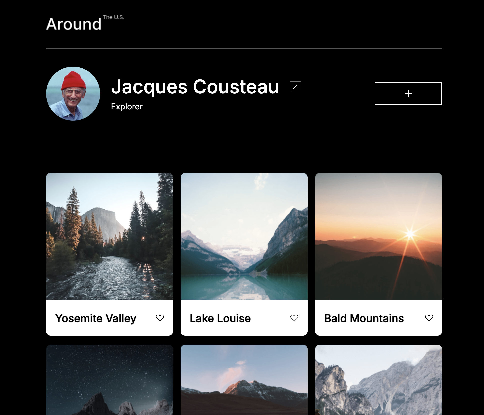

# Project 3: Around The U.S.

## Overview

- Published Link

* Project Description and features
* Figma
* Screenshots/Video
* Technology Used

### Published Link

[link to project](http://annaeckman.github.io/se_project_aroundtheus)

### Project Description

This project is made so all elements are displayed correctly on popular screen sizes.

- Semantic HTML5
- Flexbox
- Grid
- Vectors, fonts, user interfaces
- Responsive design principles
- JS Form Validation with dynamic buttons
- UX updates with multiple user options for closing modals

### Figma

[link to Figma Project](https://www.figma.com/file/Es8zZP3ARGH9JGcw60i3OD/Sprint-3_-Around-the-US?type=design&node-id=0-1&mode=design&t=u0tUkTgrYBe53iaH-0)
[form validation figma design](https://www.figma.com/file/N3zUeequnpvMX807FfYAZW/Sprint-6-Around-The-U.S.?type=design&node-id=0-1&mode=design&t=4yVbF5EURdIkyySl-0)

### Screenshots/Video

[link to video showcasing project and its features](https://www.loom.com/share/597bbbebc0dd4264af861d3c4dde6e39?sid=0f1b734d-a2ca-4d81-9b11-d01a4f01d5a9)

### Technologies Used

- HTML5, CSS, BEM, JS
