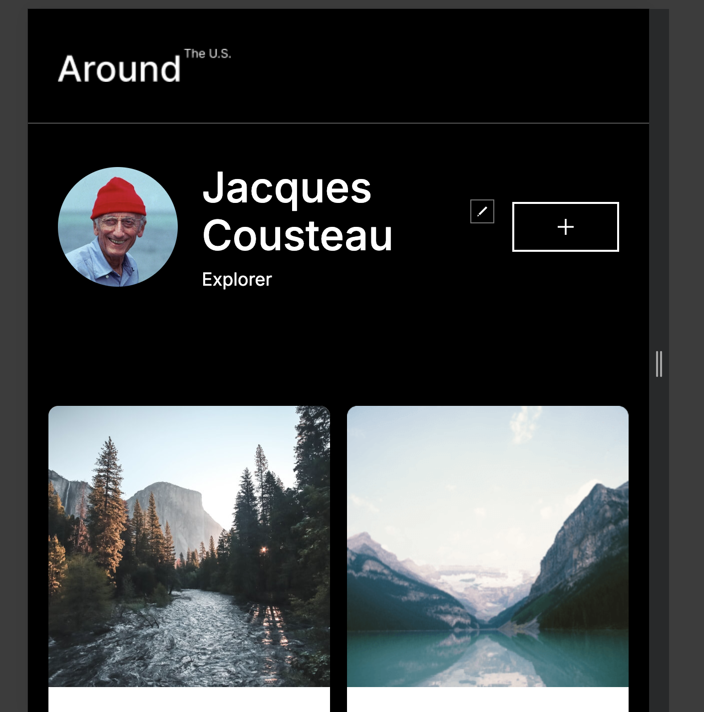
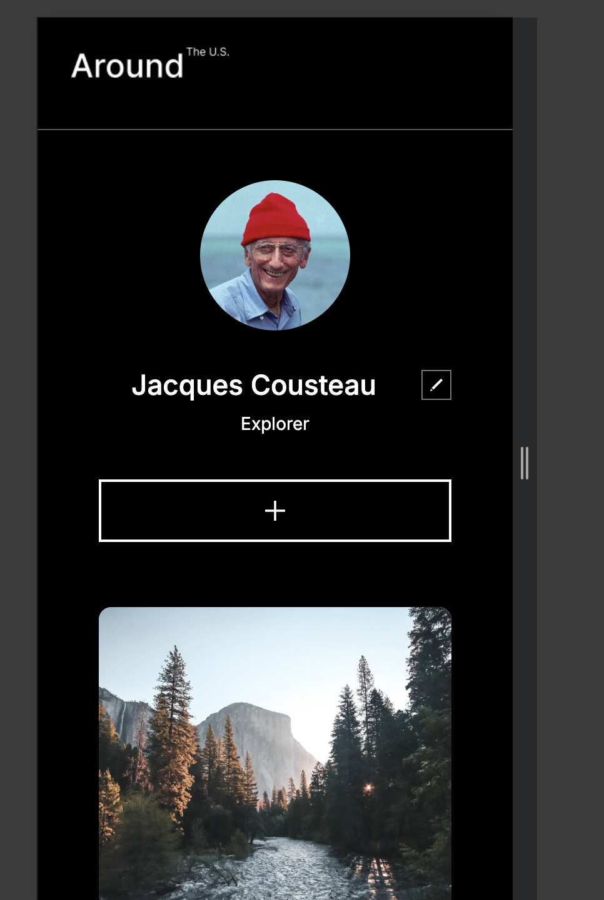

# Project 3: Around The U.S.

## Overview

- Project Description and features
- Figma
- Screenshots/Video
- Technology Used

* Published Link

### Project Description

This is a website featuring pictures of breathtaking places around the U.S. It is compatible on all screen sizes and was created with a Figma file specifying a layout for both Desktop and Mobile screens.

- Semantic HTML5
- Flexbox
- Grid
- Responsive design principles

### Figma

[link to Figma Project](https://www.figma.com/file/Es8zZP3ARGH9JGcw60i3OD/Sprint-3_-Around-the-US?type=design&node-id=0-1&mode=design&t=u0tUkTgrYBe53iaH-0)

### Screenshots/Video

### Technologies Used

- HTML5, CSS, BEM

### Published Link
